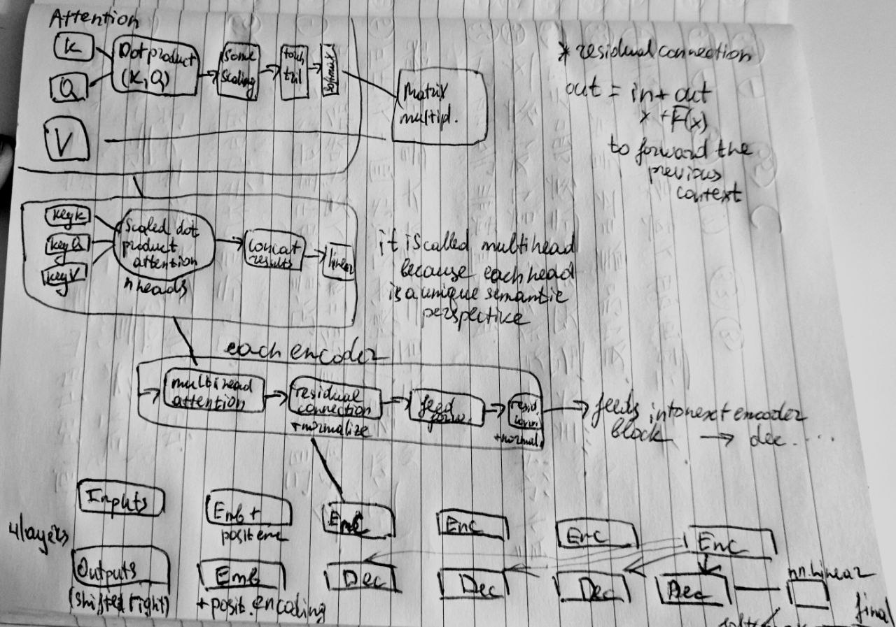

# Neural Networks and Attention Mechanisms

### What is tokenization, and why is it important in processing text data?
Tokenization is a process of splitting text into pieces to find atomic features of the text.

### How does encoding differ from tokenization, and what purpose does it serve?
Encoding is a direct mapping from words, letters, or pieces of words to numbers,
making the text comprehensible to a machine.

## Embeddings

### What is an embedding layer, and why is it used in neural networks?
An embedding layer is a multidimensional dense vector space where the encoded tokens are mapped. 
Semantic similarity is key; semantically close words are close in that space. 
Initially, the embedding layer is like a random table,
updated via backpropagation and loss calculation,
later adapting to place words (tokenized and encoded) in a vector space.
This helps decipher word meanings for the computer.

### How are embeddings initialized, and how do they get updated during training?
Embeddings are initially random, later refined by loss backpropagation and recalculation of embedding vectors.

## Training and Inference

### What are the key steps involved in training a neural network?
1. Adjust and check hyperparameters.
2. Initialize layers (may include non-linearity features like ReLU and dropout).
3. Make predictions (input * weights -> predictions).
4. Calculate loss (e.g., cross-entropy loss calculation requires predictions and labels).
5. Backpropagate loss through layers.
6. Update weights with `optimizer.step()` according to the backpropagated loss.

### What steps are omitted during inference, and why?
- **Loss calculation** is omitted.
- **Loss backpropagation** is omitted.
- **Weights update** is omitted.

These steps are omitted because they are only needed during training, 
not when using the model for predictions.

## Gradient Calculation and Optimization

### Explain the role of `loss.backward()` in training a neural network.
`loss.backward()` calculates the gradients.

### What does `optimizer.step()` do, and how does it relate to `loss.backward()`?
`optimizer.step()` applies the actual weights 
update based on the gradients calculated by `loss.backward()`.

## Dropout and Activation Functions

### Why are dropout layers used in neural networks, and when might you choose to use them?
Dropout layers prevent overfitting by randomly setting
some neurons to zero during training, 
forcing the network to learn more robust and generalizable features.

## Dropout
```
Input: [x1, x2, x3, x4]
        |    |    |    |
        |    |    |    |
       W1   W2   W3   W4
        |    |    |    |
        |    |    |    |
      [h1,  0,  h3,  0]   <- Dropout applied (50% dropout rate)
        |    |    |    |
        |    |    |    |
     Output: [y1, y2, y3, y4]
```

### What are activation functions, and why are they important in neural networks?
Activation functions introduce non-linearity into the network,
enabling it to learn complex patterns and relationships. 
Examples include Sigmoid, Tanh, ReLU, and Leaky ReLU.

ReLU: Outputs zero for any negative input and the input itself for any positive input.
Softmax: Converts input scores into probabilities that sum to 1, 
         used typically in the output layer for classification.
Tanh: A sigmoid-like function that outputs values between -1 and 1, 
      with steeper transitions at the extremes.


## Attention Mechanisms

### Essence of Attention
Attention allows models to understand relationships and meanings
between features (like tokenized and encoded words) within a sequence,
adapting to different contexts (e.g., "Apple" as a company versus a fruit).

### Vector Production
For each word sequence, Query (Q), Key (K), and Value (V) vectors
are generated initially with random initialization. 
These vectors are linearly derived from the embeddings.

### Calculation of Attention Weights
The Query and Key vectors are multiplied to produce attention scores (Ws), 
representing the relevance of each word to others in the sequence.

### Weighted Sum
The attention scores (Ws) are used to scale the Value vectors (V), 
producing weighted sums known as scaled dot products.

### Training and Adaptation
Initially random, the attention vectors (Q, K, V) are updated during training
as part of the model's learning process, 
refining their representations to better capture meaningful context.

### Role in Understanding
Attention enhances "machine understanding" by providing 
adaptable variables that encode 
the significance of each word in relation to others, 
crucial for tasks requiring context comprehension.

### Diagram of How Attention Works
```
=================================
Q = query vector (what am i looking for)
K = key vector (what do i contain)
Input Sequence:     [I]         [love]       [apples]       [a lot]
Embeddings:        [E_i]        [E_l]         [E_a]         [E_lo]
                     |            |             |             |
Transform to:      Q_i, K_i, V_i  Q_l, K_l, V_l  Q_a, K_a, V_a  Q_lo, K_lo, V_lo
                     |            |             |             |
Attention Scores:
                 Q_i * K_i    Q_i * K_l     Q_i * K_a     Q_i * K_lo
                 Q_l * K_i    Q_l * K_l     Q_l * K_a     Q_l * K_lo
                 Q_a * K_i    Q_a * K_l     Q_a * K_a     Q_a * K_lo
                 Q_lo * K_i   Q_lo * K_l    Q_lo * K_a    Q_lo * K_lo
                     |            |             |             |
Softmax Weights:
                 W_ii            W_il          W_ia          W_ilo
                 W_li            W_ll          W_la          W_llo
                 W_ai            W_al          W_aa          W_alo
                 W_loi           W_lol         W_loa         W_lolo
                     |            |             |             |
Weighted Sums:
Output for "I":      W_ii * V_i + W_il * V_l + W_ia * V_a + W_ilo * V_lo
Output for "love":   W_li * V_i + W_ll * V_l + W_la * V_a + W_llo * V_lo
Output for "apples": W_ai * V_i + W_al * V_l + W_aa * V_a + W_alo * V_lo
Output for "a lot":  W_loi * V_i + W_lol * V_l + W_loa * V_a + W_lolo * V_lo
=================================
```

Diagram of transformer layer
```
+-----------------------------------------------+
Input Sequence:        [I love apples a lot]

Embedding Layer:       Embeddings of input words -> [E_i, E_l, E_a, E_lo]

Positional Encoding:   Adds position information to embeddings
                       [E_i + PE_i, E_l + PE_l, E_a + PE_a, E_lo + PE_lo]

Multi-Head Attention:  Computes multiple sets of attention scores
                       [Head_1, Head_2, ..., Head_h]
                       Concatenate and linearly transform -> [C_i, C_l, C_a, C_lo]

Feedforward Layer:     Processes the representations with two linear layers and ReLU
Activation Function:   Adds non-linearity
Dropout Layer:         Regularization to prevent overfitting

Output Layer:          Final contextualized representations

+-----------------------------------------------+

+------------------------------------+
|       Types of Attention           |
+------------------------------------+
|                                    |
|  1. Self-Attention (Intra-Attention)|
|  2. Global Attention               |
|  3. Local Attention                |
|  4. Scaled Dot-Product Attention   |
|  5. Additive Attention (Bahdanau)  |
|  6. Multiplicative Attention (Luong)|
|  7. Hard Attention                 |
|  8. Soft Attention                 |
|  9. Hierarchical Attention         |
|  10. Cross-Attention               |
|                                    |
+------------------------------------+
```



#### ModuleList =/= Sequential. Sequential is synchronous

Practical Implementation:

## Can you describe the steps involved in setting up a simple neural network model in PyTorch,
### including defining the model, loss function, and optimizer?
```
1. Import Libraries
   +----------------------+
   | import torch         |
   | import torch.nn as nn|
   | import torch.optim   |
   +----------------------+

2. Define Model
   +----------------------+
   | class Net(nn.Module):|
   |    def __init__(self):|
   |        super(Net, self).__init__() |
   |        self.layer = nn.Linear(in_features, out_features)|
   |    def forward(self, x):|
   |        return self.layer(x)|
   | model = Net()|
   +----------------------+

3. Define Loss Function
   +----------------------+
   | criterion = nn.CrossEntropyLoss()|
   +----------------------+

4. Define Optimizer
   +----------------------+
   | optimizer = torch.optim.SGD(model.parameters(), lr=0.01)|
   +----------------------+

5. Training Loop
   +-----------------------------------+
   | for epoch in range(num_epochs):   |
   |    optimizer.zero_grad()          |
   |    outputs = model(inputs)        |
   |    loss = criterion(outputs, labels)|
   |    loss.backward()                |
   |    optimizer.step()               |
   +-----------------------------------+

```

### Normalization is the process of scaling
### input data to improve training stability and performance.
- Min-Max Scaling
- Standardization (Z-score)
- Batch Normalization

### Regularization is the technique to prevent overfitting by adding constraints or penalties.
- Dropout
- L2 Regularization (Ridge)
- Early Stopping

### Activation is the function applied to neurons' outputs to introduce non-linearity.
- ReLU
- Tanh
- Softmax

### Large Dataset:
#### If you have a large dataset, reducing the validation set to a smaller proportion might still leave you with a sufficiently large validation set for reliable evaluation. For instance, if you have 100,000 samples, a 90-10 split still gives you 10,000 samples for validation.


#### WILL LEARN LATER SECTION ####
Batch Processing:
What is the purpose of a BucketIterator in the context of text data?
will cover later
How does sorting within batches help when training models with variable-length sequences?
will cover later

Conceptual Understanding:

Why is it important to include sequence lengths when working with RNNs or LSTMs?
Real-World Applications:

How would you handle text data that contains a lot of unique tokens (e.g., usernames, URLs) in your preprocessing steps?
Optimization Techniques:

What are some common optimization algorithms besides Adam, and in what scenarios might you use them?

```
import torch
import torch.nn as nn
from torch.nn import functional as F
import mmap
import random
import pickle
import argparse


# parser = argparse.ArgumentParser(description='This is a demonstration program')

# Here we add an argument to the parser, specifying the expected type, a help message, etc.
# parser.add_argument('-batch_size', type=str, required=True, help='Please provide a batch_size')

# args = parser.parse_args()

# Now we can use the argument value in our program.
# print(f'batch size: {args.batch_size}')
device = 'cuda' if torch.cuda.is_available() else 'cpu'

batch_size = 64 # int(args.batch_size)
block_size = 128
max_iters = 12000
learning_rate = 3e-6
eval_iters = 100
n_embd = 512
n_head = 8
n_layer = 8
dropout = 0.14

print(device)

chars = ""
with open("vocab.txt", 'r', encoding='utf-8') as f:
        text = f.read()
        chars = sorted(list(set(text)))

vocab_size = len(chars)


string_to_int = { ch:i for i,ch in enumerate(chars) }
int_to_string = { i:ch for i,ch in enumerate(chars) }
encode = lambda s: [string_to_int[c] for c in s]
decode = lambda l: ''.join([int_to_string[i] for i in l])

# memory map for using small snippets of text from a single file of any size
def get_random_chunk(split):
    filename = "train_split.txt" if split == 'train' else "val_split.txt"
    with open(filename, 'rb') as f:
        with mmap.mmap(f.fileno(), 0, access=mmap.ACCESS_READ) as mm:
            # Determine the file size and a random position to start reading
            file_size = len(mm)
            start_pos = random.randint(0, (file_size) - block_size*batch_size)

            # Seek to the random position and read the block of text
            mm.seek(start_pos)
            block = mm.read(block_size*batch_size-1)

            # Decode the block to a string, ignoring any invalid byte sequences
            decoded_block = block.decode('utf-8', errors='ignore').replace('\r', '')

            # Train and test splits
            data = torch.tensor(encode(decoded_block), dtype=torch.long)

    return data


def get_batch(split):
    data = get_random_chunk(split)
    ix = torch.randint(len(data) - block_size, (batch_size,))
    x = torch.stack([data[i:i+block_size] for i in ix])
    y = torch.stack([data[i+1:i+block_size+1] for i in ix])
    x, y = x.to(device), y.to(device)
    return x, y


class Head(nn.Module):
    """ one head of self-attention """

    def __init__(self, head_size):
        super().__init__()
        self.key = nn.Linear(n_embd, head_size, bias=False)
        self.query = nn.Linear(n_embd, head_size, bias=False)
        self.value = nn.Linear(n_embd, head_size, bias=False)
        self.register_buffer('tril', torch.tril(torch.ones(block_size, block_size)))

        self.dropout = nn.Dropout(dropout)

    def forward(self, x):
        # input of size (batch, time-step, channels)
        # output of size (batch, time-step, head size)
        B,T,C = x.shape
        k = self.key(x)   # (B,T,hs)
        q = self.query(x) # (B,T,hs)
        # compute attention scores ("affinities")
        wei = q @ k.transpose(-2,-1) * k.shape[-1]**-0.5 # (B, T, hs) @ (B, hs, T) -> (B, T, T)
        wei = wei.masked_fill(self.tril[:T, :T] == 0, float('-inf')) # (B, T, T)
        wei = F.softmax(wei, dim=-1) # (B, T, T)
        wei = self.dropout(wei)
        # perform the weighted aggregation of the values
        v = self.value(x) # (B,T,hs)
        out = wei @ v # (B, T, T) @ (B, T, hs) -> (B, T, hs)
        return out


class MultiHeadAttention(nn.Module):
    """ multiple heads of self-attention in parallel """

    def __init__(self, num_heads, head_size):
        super().__init__()
        self.heads = nn.ModuleList([Head(head_size) for _ in range(num_heads)])
        self.proj = nn.Linear(head_size * num_heads, n_embd)
        self.dropout = nn.Dropout(dropout)

    def forward(self, x):
        out = torch.cat([h(x) for h in self.heads], dim=-1) # (B, T, F) -> (B, T, [h1, h1, h1, h1, h2, h2, h2, h2, h3, h3, h3, h3])
        out = self.dropout(self.proj(out))
        return out


class FeedFoward(nn.Module):
    """ a simple linear layer followed by a non-linearity """

    def __init__(self, n_embd):
        super().__init__()
        self.net = nn.Sequential(
            nn.Linear(n_embd, 4 * n_embd),
            nn.ReLU(),
            nn.Linear(4 * n_embd, n_embd),
            nn.Dropout(dropout),
        )

    def forward(self, x):
        return self.net(x)

class Block(nn.Module):
    """ Transformer block: communication followed by computation """

    def __init__(self, n_embd, n_head):
        # n_embd: embedding dimension, n_head: the number of heads we'd like
        super().__init__()
        head_size = n_embd // n_head
        self.sa = MultiHeadAttention(n_head, head_size)
        self.ffwd = FeedFoward(n_embd)
        self.ln1 = nn.LayerNorm(n_embd)
        self.ln2 = nn.LayerNorm(n_embd)

    def forward(self, x):
        y = self.sa(x)
        x = self.ln1(x + y)
        y = self.ffwd(x)
        x = self.ln2(x + y)
        return x

class GPTLanguageModel(nn.Module):
    def __init__(self, vocab_size):
        super().__init__()
        self.token_embedding_table = nn.Embedding(vocab_size, n_embd)
        self.position_embedding_table = nn.Embedding(block_size, n_embd)
        self.blocks = nn.Sequential(*[Block(n_embd, n_head=n_head) for _ in range(n_layer)])
        self.ln_f = nn.LayerNorm(n_embd) # final layer norm
        self.lm_head = nn.Linear(n_embd, vocab_size)


        self.apply(self._init_weights)

    def _init_weights(self, module):
        if isinstance(module, nn.Linear):
            torch.nn.init.normal_(module.weight, mean=0.0, std=0.02)
            if module.bias is not None:
                torch.nn.init.zeros_(module.bias)
        elif isinstance(module, nn.Embedding):
            torch.nn.init.normal_(module.weight, mean=0.0, std=0.02)

    def forward(self, index, targets=None):
        # print(index.shape)
        B, T = index.shape


        # idx and targets are both (B,T) tensor of integers
        tok_emb = self.token_embedding_table(index) # (B,T,C)
        pos_emb = self.position_embedding_table(torch.arange(T, device=device)) # (T,C)
        x = tok_emb + pos_emb # (B,T,C)
        x = self.blocks(x) # (B,T,C)
        x = self.ln_f(x) # (B,T,C)
        logits = self.lm_head(x) # (B,T,vocab_size)

        if targets is None:
            loss = None
        else:
            B, T, C = logits.shape
            logits = logits.view(B*T, C)
            targets = targets.view(B*T)
            loss = F.cross_entropy(logits, targets)

        return logits, loss

    def generate(self, index, max_new_tokens):
        # index is (B, T) array of indices in the current context
        for _ in range(max_new_tokens):

            # get the predictions
            logits, loss = self.forward(index)
            # focus only on the last time step
            logits = logits[:, -1, :] # becomes (B, C)
            # apply softmax to get probabilities
            probs = F.softmax(logits, dim=-1) # (B, C)
            # sample from the distribution
            index_next = torch.multinomial(probs, num_samples=1) # (B, 1)
            # append sampled index to the running sequence
            index = torch.cat((index, index_next), dim=1) # (B, T+1)
        return index
     

model = GPTLanguageModel(vocab_size)
# print('loading model parameters...')
# with open('model-01.pkl', 'rb') as f:
#     model = pickle.load(f)
# print('loaded successfully!')
m = model.to(device)

@torch.no_grad()
def estimate_loss():
    out = {}
    model.eval()
    for split in ['train', 'val']:
        losses = torch.zeros(eval_iters)
        for k in range(eval_iters):
            X, Y = get_batch(split)
            logits, loss = model(X, Y)
            losses[k] = loss.item()
        out[split] = losses.mean()
    model.train()
    return out


# create a PyTorch optimizer
optimizer = torch.optim.AdamW(model.parameters(), lr=learning_rate)

import matplotlib.pyplot as plt
from tqdm import tqdm

# Initialize variables for tracking the minimum loss and storing loss values
min_loss = float('inf')
train_losses = []
val_losses = []

# Function to plot loss values
def plot_losses(train_losses, val_losses):
    plt.figure(figsize=(10, 5))
    plt.plot(train_losses, label='Train Loss')
    plt.plot(val_losses, label='Validation Loss')
    plt.xlabel('Iterations (x' + str(eval_iters) + ')')
    plt.ylabel('Loss')
    plt.legend()
    plt.title('Training and Validation Loss Over Time')
    plt.show()

for iter in tqdm(range(max_iters), desc="Training Progress"):
    if iter % eval_iters == 0:
        losses = estimate_loss()
        train_losses.append(losses['train'])
        val_losses.append(losses['val'])

        print(f"step: {iter}, train loss: {losses['train']:.3f}, val loss: {losses['val']:.3f}")

        # Calculate the difference and percentage change from the minimal loss value
        if min_loss == float('inf'):
            min_loss = losses['train']
        loss_diff = losses['train'] - min_loss
        loss_percentage_change = (loss_diff / min_loss) * 100
        print(f"Current train loss: {losses['train']:.6f}, Loss difference: {loss_diff:.6f}, Percentage change: {loss_percentage_change:.2f}%")

        # Update the minimum loss if the current loss is lower
        if losses['train'] < min_loss:
            min_loss = losses['train']

        if loss_percentage_change <= 1:
            print(f"Algorithm has converged at step {iter}. Loss percentage change is {loss_percentage_change:.2f}%")

    # Sample a batch of data
    xb, yb = get_batch('train')

    # Evaluate the loss
    logits, loss = model.forward(xb, yb)
    optimizer.zero_grad(set_to_none=True)
    loss.backward()
    optimizer.step()

# Print the final loss
print(f"Final loss: {loss.item():.6f}")

# Plot the loss values
plot_losses(train_losses, val_losses)


with open('model-01.pkl', 'wb') as f:
    pickle.dump(model, f)
print('model saved')

prompt = 'Hello! Can you see me?'
context = torch.tensor(encode(prompt), dtype=torch.long, device=device)
generated_chars = decode(model.generate(context.unsqueeze(0), max_new_tokens=100)[0].tolist())
print(generated_chars)

```

### Scheduler
#### This scheduler reduces the learning rate when a metric has stopped improving.
#### mode='min' indicates that the learning rate will be reduced when the quantity monitored has stopped decreasing.
#### factor=0.1 means the learning rate will be reduced by a factor of 10.
#### patience=10 means the scheduler will wait for 10 epochs without improvement before reducing the learning rate.
#### verbose=True will print a message to the console whenever the learning rate is reduced.


### Understanding Loss Behavior During Training
#### Initial Rapid Decrease:
##### At the beginning of training, the model's parameters are far from their optimal values. During this phase, each gradient update leads to significant improvements, causing a rapid decrease in loss.
#### Slowing Down:
##### As training progresses, the model parameters approach a local minimum of the loss function. Gradient updates start to result in smaller improvements, leading to a slower decrease in loss. This phase often looks like a plateau when plotted.
#### Convergence:
##### Eventually, the loss might converge to a value where further training does not significantly decrease the loss. This indicates that the model is reaching its capacity to minimize the training loss given the current learning rate and architecture.

#### Large language models can produce different outputs for the same input due to random sampling techniques, such as temperature, top-k, and top-p sampling, used during token generation. This inherent randomness introduces variability even with identical model parameters and probability distributions.
#### Quantization in large language models involves reducing the precision of weights and activations from higher-bit representations (e.g., 32-bit floating-point) to lower-bit formats (e.g., 8-bit integers) to decrease memory usage, computational load, and improve inference speed. While it can slightly reduce model accuracy, it significantly enhances efficiency, making large models more practical for deployment.

#### 
#### In the realm of deep learning, text serves as raw ore, brimming with potential information. Through the intricate process of training, deep learning models refine this raw material into valuable insights—represented by learned parameters. These parameters, akin to refined materials, embody the essence of the text's meaning and structure, enabling models to weave increasingly finer nets of understanding. The quality of these refined parameters directly impacts the model's ability to generate coherent text and perform complex language tasks with precision and nuance.


```
Neural networks, including transformers, are designed to identify and learn patterns 
in data by adjusting weights through training. 
These weights are initially set randomly and are gradually adjusted based on the data to minimize error. 
The process of weight adjustment can be visualized as navigating and optimizing within a high-dimensional space, 
where each dimension represents a feature or aspect of the data.

In the context of natural language processing, meanings and relations in human language can be
thought of as existing within a complex, high-dimensional vector space. Neural networks aim to map language
data into this space in a way that preserves the semantic relationships between words, phrases, and sentences.

The algorithm we used to approximate a surface in the provided code is analogous to this process but simplified. 
Just as the algorithm iteratively refines the approximation of a surface, a neural network iteratively refines its understanding of data 
by adjusting weights. Both processes involve optimizing within a multidimensional space to better fit the target data.

Key Points:
Neural Networks and Transformers:

Aim to identify and learn patterns in data.
Adjust weights iteratively to minimize error.
Operate in a high-dimensional vector space.
Language as a High-Dimensional Space:

Semantic meanings and relationships in language can be represented as points in a high-dimensional vector space.
Neural networks map language data into this space to capture semantic relationships.
Algorithm Analogy:

The surface approximation algorithm adjusts a function to better fit a target surface iteratively.
Similarly, neural networks iteratively adjust weights to better fit the data.
Example of Refinement:
The provided code creates a simplified model where an initial rough surface is iteratively refined to approximate a true surface.
This mirrors how a neural network starts with random weights and iteratively refines them to capture the underlying patterns in the training data.
Both processes involve moving through a multidimensional space to reduce error and improve the fit to the target.

```